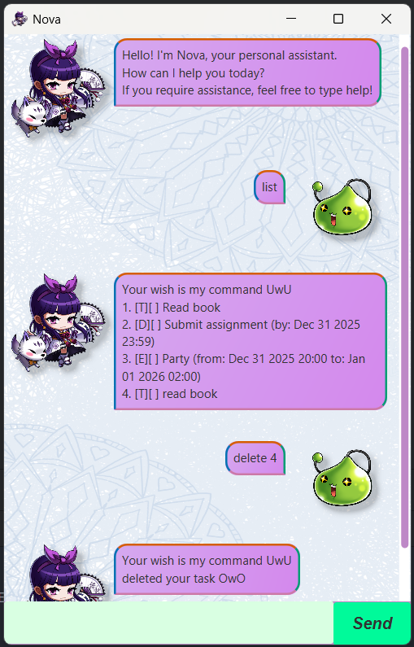

# Nova User Guide


Nova Chatbot is a lightweight, Java-based personal assistant for managing your tasks. With Nova, you can add to-dos, deadlines, and events using simple commands, view your task list, and even undo or redo changes. Nova’s conversational tone and intuitive error messages make task management both efficient and enjoyable.

## Adding To-Dos
Example: `todo Read Book`

```
Your wish is my command UwU
added to-do task Read Book OwU!
```

## Adding deadlines
Example: `deadline Return Textbook /by 2025-03-05 19:30`

```
Your wish is my command UwU
added deadline Return Textbook OwU!
```

## Adding events
Example: `event Lecture /from 2025-02-19 12:00 /to 2025-02-19 14:00`

```
Your wish is my command UwU
added event Lecture :(
```

## Feature List

Displays all added tasks

Example: `list`
```
Your wish is my command UwU
1.[T][ ] Read Book
2.[D][ ] Return Textbook (by: mar 05 2025 19:30)
3.[E][ ] Lecture (from: Feb 19 2025 12:00 to: Feb 19 2025 14:00)
```

## Feature Mark Task

// Feature details
Mark a task as done

Example: `mark 1`

```
Your wish is my command UwU
marked task as done OwO
```

## Feature Unmark Task

Mark a task as not done

Example: `unmark 1`

```
Your wish is my command UwU
unmarked your task OwO
```

## Feature Delete Task

Deletes a task

Example: `delete 3`

```
Your wish is my command UwU
deleted your task OwO
```

## Feature Find Task

Finds a task based on the description

Example: `find Read`

```
Your wish is my command UwU
1.[T][ ] Read Book
```

## Feature Undo Action

// Feature details
Undo the previous action that edited tasks

Example: `undo`

```
Your wish is my command UwU
your action has been undone :)
```

## Feature Redo Action

// Feature details
Re-applies an undone action

Example: `redo`

```
Your wish is my command UwU
your action has been reverted :)
```

## Feature Help

Provides functions and command formats

Example: `help`

```
Your wish is my command UwU
Single word commands are:
List, Undo. Redo, Find, Bye, Help

Adding a todo task:
todo <description>

Adding a deadline task:
deadline <description> /by <YYY-MM-DD HH:MM>

Adding a event task:
event <description> /from <YYY-MM-DD HH:MM> /to <YYY-MM-DD HH:MM>

!!! Please do not use '/' in your descriptions !!!
```

## Feature Bye

Exits the chatbot

Example: `bye`